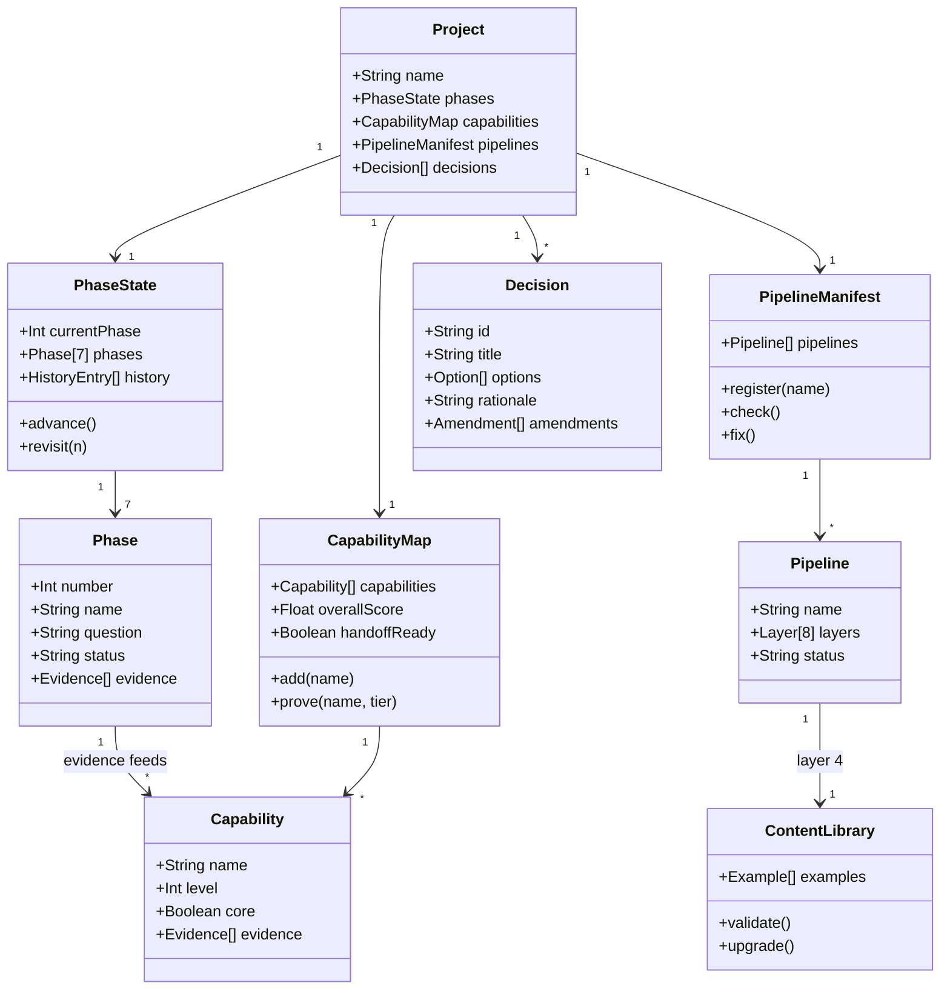
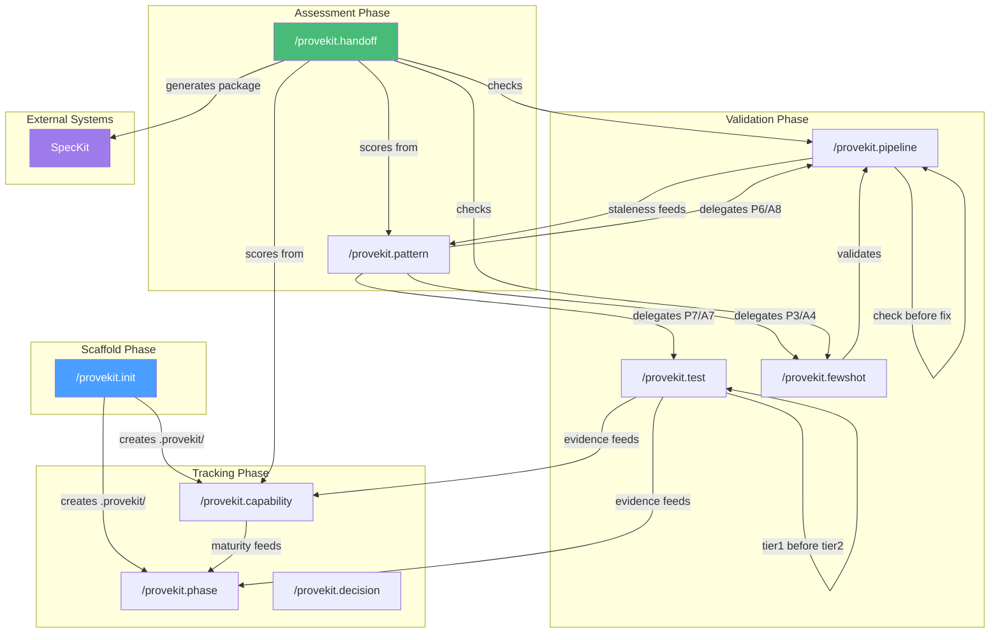
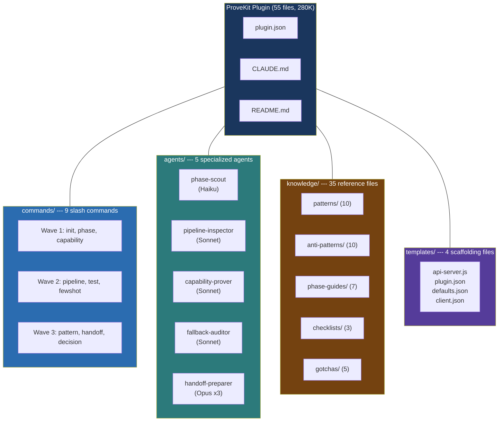
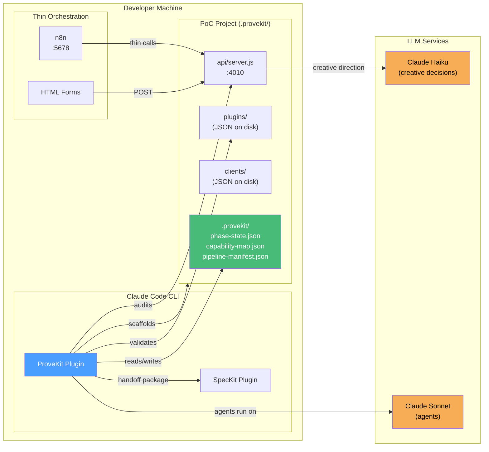
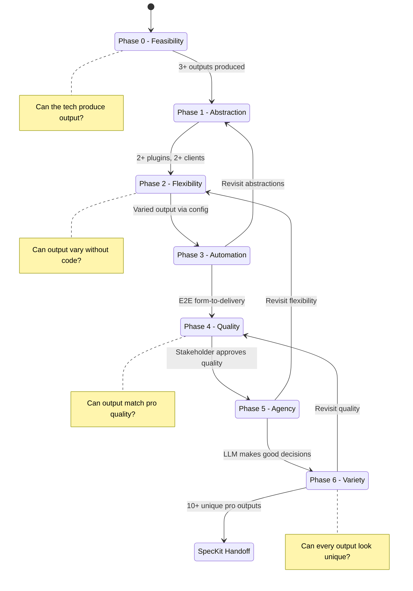

# ProveKit

**"Prove it works. Then build it right."**

A Claude Code plugin for backend-first PoC iteration. ProveKit helps teams iterate heavily on backend/business logic with thin orchestration, prove the idea at production-grade output quality, and only then consider building a full app.

ProveKit is the step BEFORE [SpecKit](https://github.com/caburgoin/specKitPulso) in the development lifecycle: you **prove** the idea works, then SpecKit helps you **build** it right.

## The Problem

Teams jump to full-stack development too early, spending 70%+ effort on UI, auth, state management, and deployment --- only to discover the core idea needs pivoting, causing rework across all layers.

## The Solution

ProveKit enforces a backend-first methodology with 7 phases, 10 patterns, and 6 maturity levels. It tracks what you've proven, detects when your pipeline is stale, and tells you when you're ready to hand off to production development.

---

## Architecture (4+1 Views)

### Scenarios View (+1): User Journey

The central use case that ties all views together --- a team taking an idea from concept to production handoff.

```mermaid
journey
    title ProveKit User Journey
    section Phase 0-1: Prove Feasibility
      Scaffold project: 5: Developer
      Build thick backend: 4: Developer
      Run script tests: 4: Developer, Agent
      Register capabilities: 3: Developer
    section Phase 2-3: Prove Flexibility
      Add content library: 4: Developer
      Detect pipeline staleness: 5: Agent
      Test via API: 4: Developer, Agent
      Add thin orchestration: 3: Developer
    section Phase 4-5: Prove Quality
      Integrate pro assets: 4: Developer
      Add LLM decisions: 5: Developer, Agent
      Stakeholder review: 3: Stakeholder
    section Phase 6: Prove Variety
      Generate 10 outputs: 5: Agent
      Pattern audit: 4: Agent
      Handoff to SpecKit: 5: Developer, Agent
```

### Logical View: Domain Model

The key abstractions and their relationships --- how ProveKit models a PoC project.



### Process View: Command Workflows

Runtime behavior --- how the 9 commands interact and what triggers what.



### Development View: Module Organization

Static structure of the plugin --- directories, files, and their responsibilities.



### Physical View: Deployment Topology

How ProveKit fits into the developer's environment and the tools it orchestrates.



### Cross-Cutting: Phase Progression Model

The 7-phase journey that spans all views --- from feasibility to handoff.



### Cross-Cutting: Maturity Levels

How capabilities mature through the three testing tiers.

```mermaid
flowchart LR
    L0["Level 0\nIDEA"]
    L1["Level 1\nPROTOTYPE"]
    L2["Level 2\nSCRIPT-PROVEN"]
    L3["Level 3\nAPI-PROVEN"]
    L4["Level 4\nE2E-PROVEN"]
    L5["Level 5\nPRODUCTION"]

    L0 -->|code exists| L1
    L1 -->|Tier 1 passes| L2
    L2 -->|Tier 2 passes| L3
    L3 -->|Tier 3 passes| L4
    L4 -->|stakeholder validates| L5

    style L0 fill:#a0aec0,color:#000
    style L1 fill:#fc8181,color:#000
    style L2 fill:#f6ad55,color:#000
    style L3 fill:#f6e05e,color:#000
    style L4 fill:#68d391,color:#000
    style L5 fill:#63b3ed,color:#000
```



---

## Commands

| Command | Purpose | Key Actions |
|---------|---------|-------------|
| `/provekit.init` | Scaffold PoC project | Creates api/, plugins/, clients/, .provekit/ |
| `/provekit.phase` | Phase management | status, advance, revisit |
| `/provekit.capability` | Maturity tracking | add, prove, list, detail |
| `/provekit.pipeline` | Staleness detection | check, fix, register, list |
| `/provekit.test` | Three-tier testing | tier1, tier2, tier3, status |
| `/provekit.fewshot` | Content library mgmt | validate, upgrade, add, diff |
| `/provekit.pattern` | Pattern audit | 10 patterns + 10 anti-patterns |
| `/provekit.handoff` | SpecKit readiness | score, check hard reqs, generate package |
| `/provekit.decision` | Architecture decisions | add, list, detail, amend |

## Agents

| Agent | Model | Purpose |
|-------|-------|---------|
| Phase Scout | Haiku | Recommends next iteration phase |
| Pipeline Inspector | Sonnet | Deep cross-layer staleness analysis |
| Capability Prover | Sonnet | Automated evidence gathering |
| Fallback Auditor | Sonnet | Backward compatibility verification |
| Handoff Preparer | Opus x3 | Multi-perspective readiness assessment |

## Knowledge Base

- **10 Patterns**: Thin Orchestration, Config-as-Code, Few-Shot Learning, LLM-Driven Decisions, Fallback Chains, Pipeline Staleness Prevention, Three-Tier Testing, Iterative Uplift, Separation of Concerns, Asset Pipeline
- **10 Anti-Patterns**: Premature UI, Database Before Validation, Framework Overhead, Stale Content Library, Missing Fallbacks, Hardcoded Creativity, Tier Skipping, Pipeline Staleness, Logic in Orchestration, Premature Production
- **7 Phase Guides**: One per phase with evidence criteria, what to build/avoid, and Remotion PoC examples
- **3 Checklists**: Schema change, pipeline staleness, handoff readiness
- **5 Gotchas**: Node module cache, LLM follows examples, n8n stuck executions, port conflicts, JSON parse errors

## Origin

ProveKit was extracted from the [Remotion PoC](https://github.com/caburgoin/remotion-poc) project, which demonstrated the methodology over 6+ phases: from static video templates to LLM-driven creative direction producing unique, professional-quality videos --- all without writing a single line of frontend code.

## License

MIT
